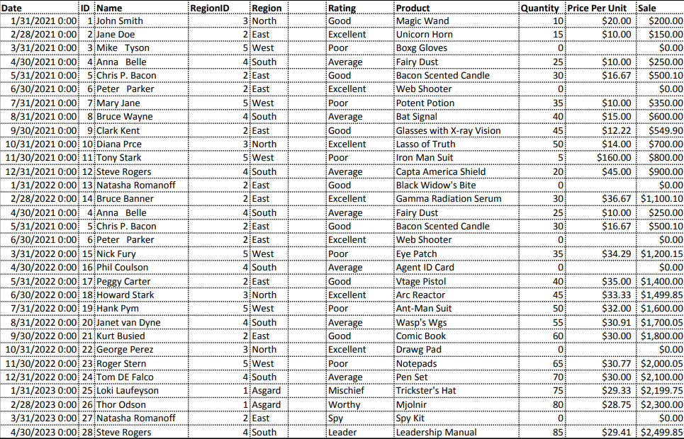
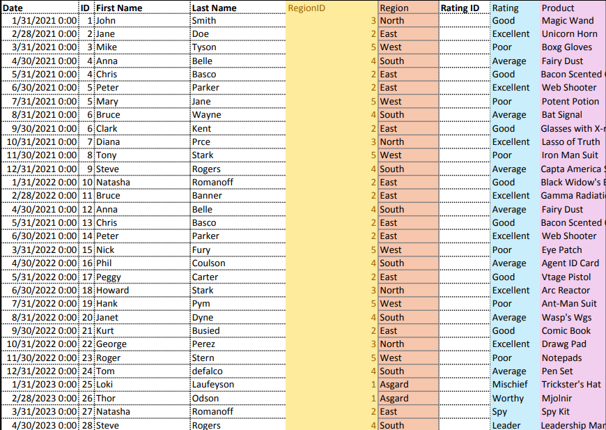

# Midterm Lab Task 1 Data Cleaning using Excel
In this task we are given raw data from excel to perform data cleaning and preparation for power query

# STEP 1 Data cleaning proccess
Open the raw file in Excel.

- Adjust column widths and row heights using AutoFit.

- Identify and eliminate duplicate entries.

- Trim unnecessary spaces from data.

- Remove NULL values for cleaner data.

- Perform a spell check to correct errors.

- Apply data validation rules for consistency.
- Handle errors using IFERROR and the Find and Replace tool.
- Format numbers appropriately for readability.
# STEP 2 Normalization
- Perform First Normal Form (1NF)

- Apply Second Normal Form (2NF) by splitting tables

- Implement Third Normal Form (3NF)

- Map the normalized tables to a Physical Data Model

# STEP 3 Here's the screenshot of my output before I started data cleaning (SEE screenshot)

# STEP 4 Here's the screenshot of my output after I started data cleaning (SEE screenshot)

# Here's the Data model

# Here's the finish work
- Normalized file
[Normalized file](File/cleandata%20William1.xlsx)
